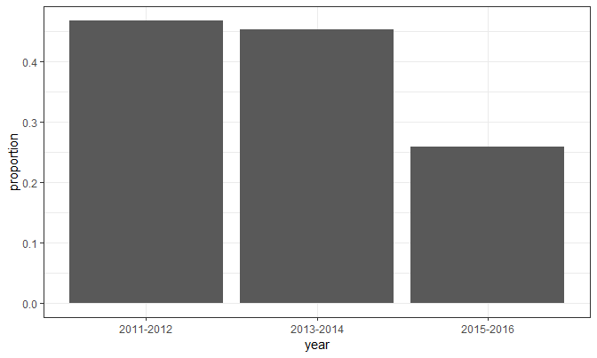
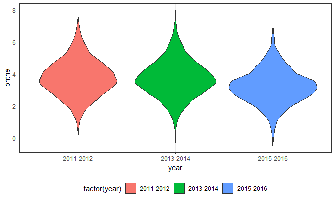
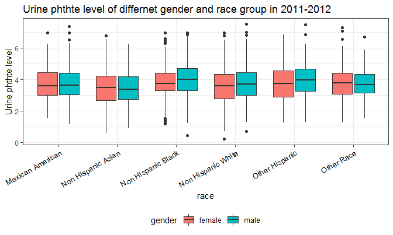
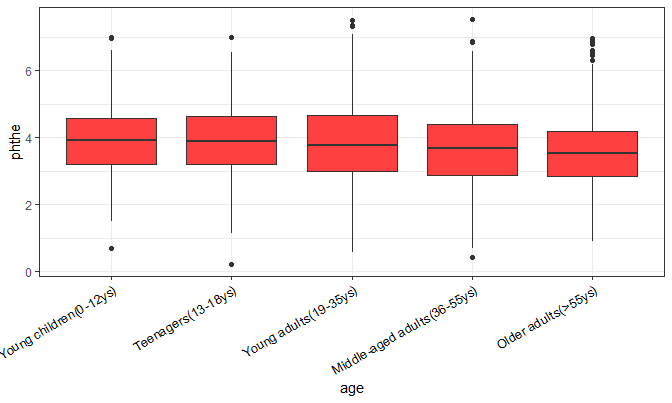

Plastic
================
Yun He, Jun Lu, Chu Yu, Chunxiao Zhai, Haoran Hu
11/21/2018

Overview
--------

Read and clean the data
-----------------------

``` r
phthte_file_name = tibble(file_name = list.files("./data/PHTHTE/"))

phthte =
  phthte_file_name %>% 
  mutate(map(str_c("./data/PHTHTE/", file_name), ~read.xport(.x))) %>% 
  unnest() 
    
demo_file_name = tibble(file_name_2 = list.files("./data/DEMO/"))

demo = 
    demo_file_name %>% 
    mutate(map(str_c("./data/DEMO/", file_name_2), ~read.xport(.x))) %>% 
    unnest()

phthe_demo = inner_join(demo, phthte, by = "SEQN") %>% 
    select(file_name, gender = RIAGENDR, age = RIDAGEYR, race = RIDRETH3, weight = WTMEC2YR, 
           income = INDFMPIR, URXCNP, URXCOP, URXECP, pregnancy_status = RIDEXPRG) %>% 
    mutate(phthe = log(URXCNP + URXCOP + URXECP),
           phthe_combin = ifelse(phthe > 3.73, 1 ,0),
           file_name = str_replace(file_name, "PHTHTE_", ""),
           file_name = str_replace(file_name, ".XPT", ""),
           race = plyr::mapvalues(race, c(1, 2, 3, 4, 6, 7), c("Mexican American", "Other Hispanic", "Non Hispanic White", "Non Hispanic Black", "Non Hispanic Asian", "Other Race")),
           pregnancy_status = plyr::mapvalues(pregnancy_status, c(1, 2, 3), c("yes", "no", "unknown")),
           gender = plyr::mapvalues(gender, c(1, 2), c("male", "female"))) %>% 
  rename(year = file_name)
```

Exploratory analysis
--------------------

Tendency analysis
-----------------

``` r
pd_tend = phthe_demo %>%
  group_by(year) %>%
  summarize(total = n(),
            proportion = length(which(phthe_combin == 1))/total)

pd_tend %>%
  ggplot(aes(x = year, y = proportion)) +
  geom_histogram(stat = "identity")
```



``` r
phthe_demo %>%
  ggplot(aes(x = year, y = phthe, fill = factor(year))) +
  geom_violin()
```



Population compare
------------------

``` r
phthe_by_year = phthe_demo %>% 
  select(year, gender, race, age, phthe) %>% 
  nest(gender:phthe)


gender_race_plot = function(year, gender_race_data) {
   gender_race_data %>% 
   mutate(gender = as.factor(gender),
          race = as.factor(race)) %>% 
   mutate(race = forcats::fct_reorder(race, gender_race_data$phthe)) %>% 
   ggplot(aes(x = race, y = phthe, fill = gender)) + 
     geom_boxplot() + 
     labs(title = str_c("Urine phthte level of differnet gender and race group in ", year), y = "Urine phthte level") +
     theme(axis.text.x = element_text(face = "plain", color = "black", size = 10, angle = 30,hjust = 1))
 }

gender_race_plot(phthe_by_year[[1,1]],phthe_by_year$data[[1]])
```



``` r
age_phthe_plot = function(year, age_data) {
  age_data %>% 
    mutate(age = cut(age,  breaks = c(0, 12, 18, 35, 55, Inf), labels = c("Young children(0-12ys)", "Teenagers(13-18ys)", "Young adults(19-35ys)", "Middle-aged adults(36-55ys)", "Older adults(>55ys)"))) %>% 
    ggplot(aes(x = age, y = phthe)) + 
    geom_boxplot(fill = "brown1") + 
    theme(axis.text.x = element_text(face = "plain", color = "black", size = 10, angle = 30,hjust = 1))
}
age_phthe_plot(phthe_by_year[[1,1]],phthe_by_year$data[[1]])
```



性别，种族，塑化剂随年龄变化
