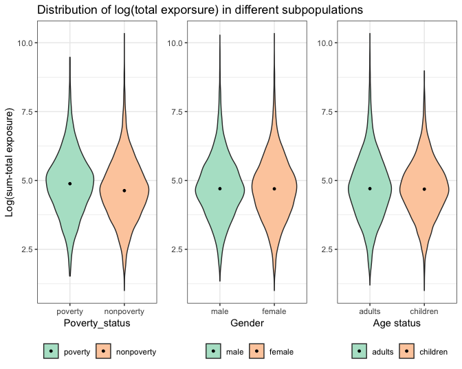
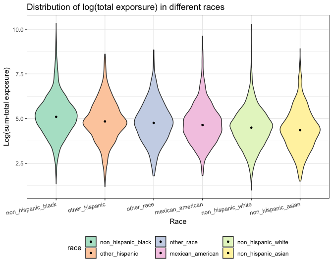
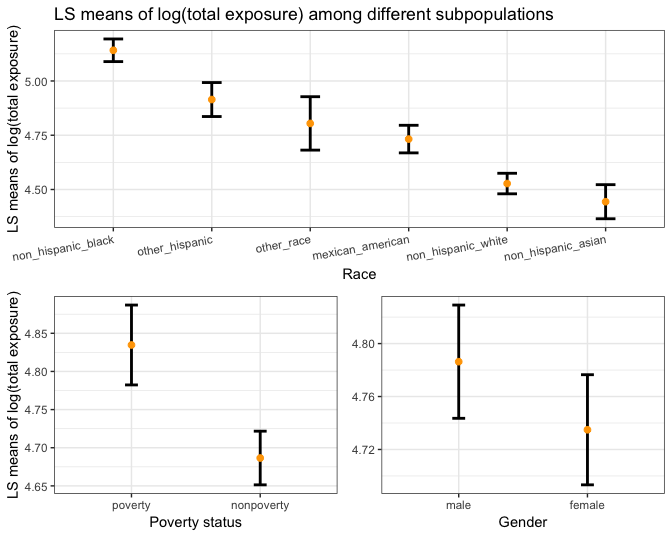
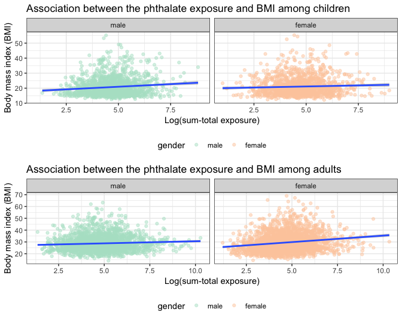

Analysis of plasticizer exposure patterns and effects of plasticizer on obesity
================
Jun Lu, Yun He, Chu Yu, Chunxiao Zhai, Haoran Hu
12/2/2018

Motivation
----------

Plasticizers, mainly phthalates, can interrupt the endocrine system even at low exposure levels, and there is evidence of plasticizers depositing in animal brains. Concerns have been rising in pediatricians and scientists. Obesity, which is a major public health problem across the world, is also associated with plasticizer exposure. Fat at first and now sugar have been blamed for causing obesity, while increasing evidence shows that plasticizer pollution is also playing an important role. However, effects of plasticizers on bodyweight within different age and gender groups are different. With more detailed monitoring data on plasticizer exposure available at NHANES datasets, we want to explore the relationship between body weight and plasticizer exposure.

Topic change
------------

Our group first aimed to work on the topic of obesity. However, the datasets we found weren't able to meet our goals. And we also found the topic not fascinating enough. Thus, we decided to switch our topic to plasticizer pollution and explore its effect on obesity as well.

Related works
-------------

-   Papers:

1.  [Phthalates and Their Alternatives: Health and Environmental Concerns](http://ec.europa.eu/environment/aarhus/pdf/35/Annex_11_report_from_Lowell_Center.pdf)
2.  [Gender- and Age-Specific Relationships Between Phthalate Exposures and Obesity in Shanghai Adults](https://doi.org/10.1007/s00244-017-0441-6)
3.  [Developmental Effects of Endocrine-disrupting Chemicals in Wildlife and Humans](https://doi.org/10.1289/ehp.93101378)
4.  [DI-2-Ethylhexyl Phthalate and Endocrine Disruption: A Review](https://doi.org/10.2174/1568008043340017)
5.  [Phthalates Impact Human Health: Epidemiological Evidences and Plausible Mechanism of Action](https://doi.org/10.1016/j.jhazmat.2017.06.036)
6.  [Phthalate Exposure and Childhood Obesity](https://www.ncbi.nlm.nih.gov/pmc/articles/PMC4114051/)
7.  [Endocrine Disruptors and Obesity](https://www.ncbi.nlm.nih.gov/pmc/articles/PMC5359373/)

-   Websites:

1.  [Plasticisers Information Center](https://www.plasticisers.org)
2.  [Global Health Observatory (GHO) Data](https://www.who.int/gho/ncd/risk_factors/overweight/en/)
3.  [Definition; epidemiology; and etiology of obesity in children and adolescents](https://www.uptodate.com/contents/definition-epidemiology-and-etiology-of-obesity-in-children-and-adolescents)
4.  [Bisphenol A (BPA): Use in Food Contact Application](https://www.fda.gov/newsevents/publichealthfocus/ucm064437.htm)
5.  [Endocrine Disruptors](https://www.niehs.nih.gov/health/topics/agents/endocrine/index.cfm)

Initial questions
-----------------

-   Are people exposed at the same level? Who has been exposed most?
-   Are distributions of different types of plasticizers same in different populations?
-   Are people exposed at the same levels of plasticizers affected the same way?
-   Is there a dose response relationship? Is this relationship linear?

Data sources
------------

All data were retrieved from the the [National Health and Nutrition Examination Survey](https://www.cdc.gov/nchs/nhanes/index.htm). The National Health and Nutrition Examination Survey (NHANES) is a program of studies designed to assess the health and nutritional status of adults and children in the United States.

We downloaded demographics data ([DEMO2011-2012](https://wwwn.cdc.gov/Nchs/Nhanes/2011-2012/DEMO_G.XPT), [DEMO2013-2014](https://wwwn.cdc.gov/Nchs/Nhanes/2013-2014/DEMO_H.XPT) and [DEMO2015-2016](https://wwwn.cdc.gov/Nchs/Nhanes/2015-2016/DEMO_I.XPT)), phthalates metabolites data ([PHTHTE2011-2012](https://wwwn.cdc.gov/Nchs/Nhanes/2011-2012/PHTHTE_G.XPT), [PHTHTE2013-2014](https://wwwn.cdc.gov/Nchs/Nhanes/2013-2014/PHTHTE_H.XPT) and [PHTHTE2015-2016](https://wwwn.cdc.gov/Nchs/Nhanes/2015-2016/PHTHTE_I.XPT)) and body measures data ([BMX2011-2012](https://wwwn.cdc.gov/Nchs/Nhanes/2011-2012/BMX_G.XPT), [BMX2013-2014](https://wwwn.cdc.gov/Nchs/Nhanes/2013-2014/BMX_H.XPT) and [BMX2015-2016](https://wwwn.cdc.gov/Nchs/Nhanes/2015-2016/BMX_I.XPT)) into three local files.

Variables selected from the demographics dataset:

-   `SEQN`: Respondent sequence number
-   `RIAGENDR`: Gender
-   `RIDAGEYR`: Age
-   `RIDRETH3`: Race and Hispanic origin information, with Non-Hispanic Asian Category
-   `INDFMPIR`: Ratio of family income to poverty

Variables selected from the phthalates metabolites dataset:

-   `SEQN`: Respondent sequence number
-   `URXMEP`: Mono-ethyl phthalate (ng/mL)
-   `URXMBP`: Mono-n-butyl phthalate (ng/mL)
-   `URXMIB`: Mono-isobutyl phthalate (ng/mL)
-   `URXMC1`: Mono-(3-carboxypropyl) phthalate (ng/mL)
-   `URXMZP`: Mono-benzyl phthalate (ng/mL)
-   `URXMHP`: Mono-(2-ethyl)-hexyl phthalate (ng/mL)
-   `URXMHH`: Mono-(2-ethyl-5-hydroxyhexyl) phthalate (ng/mL)
-   `URXMOH`: Mono-(2-ethyl-5-oxohexyl) phthalate (ng/mL)

Variables selected from the body measures dataset:

-   `SEQN`: Respondent sequence number
-   `BMXBMI`: Body Mass Index (kg/m^2)
-   `BMDBMIC`: BMI Category - Children/Youth

Packages used in this report
----------------------------

We used `tidyverse`, `tableone`, `SASxport`, `patchwork`, `emmeans` and `scales` packages in this report.

Get the data
------------

``` r
download_nhanes = function(year, data_category){
  letter = c("2011-2012" = "G", "2013-2014" = "H", "2015-2016" = "I")
  url = str_c("https://wwwn.cdc.gov/Nchs/Nhanes/", year, "/", data_category, "_", letter[year], ".XPT")
  destfile_name = str_c("./data/", data_category, "/", data_category, year, ".XPT")
  download.file(url, destfile = destfile_name, method = "curl")
}


if (!file.exists("data")) {
  dir.create("./data")
  dir.create("./data/DEMO")
  dir.create("./data/PHTHTE")
  dir.create("./data/BMX")
  year = c("2011-2012", "2013-2014", "2015-2016")
  map(year, ~download_nhanes(.x, "DEMO"))
  map(year, ~download_nhanes(.x, "PHTHTE"))
  map(year, ~download_nhanes(.x, "BMX"))
}
```

We created a function (`download_nhanes`) to download data in NHANES. Then we used this function and `map` to download demographics data, phthalates metabolites data and body measures data from 2011 to 2016 into three local files (PHTHTE, DEMO and BMX).

Read and clean the data
-----------------------

``` r
read_file_data = function(data_category){
  path = str_c("./data/", data_category, "/")
  file_name = tibble(file_name = list.files(path))
  file_name %>% 
    mutate(map(str_c(path, file_name), ~read.xport(.x))) %>% 
    unnest() 
}

phthte = read_file_data("PHTHTE")
demo = read_file_data("DEMO")
bmx = read_file_data("BMX")

phthte_demo = inner_join(demo, phthte, by = "SEQN") 
phthte_demo_bmx = inner_join(phthte_demo, bmx, by = "SEQN")

phthte_demo_bmx =
  phthte_demo_bmx %>% 
  select(id = SEQN, gender = RIAGENDR, age = RIDAGEYR, race = RIDRETH3, income = INDFMPIR, 
         bmi_cat = BMDBMIC, bmi = BMXBMI,MEP = URXMEP, MnBP = URXMBP, MiBP = URXMIB, 
         MCPP = URXMC1, MBzP = URXMZP, MEHP = URXMHP, MEHHP = URXMHH, MEOHP = URXMOH) %>%
  mutate(phthalate_all = MEP + MnBP + MiBP + MCPP + MBzP + MEHP + MEHHP + MEHHP,
         race = factor(race, levels = c(1, 2, 3, 4, 6, 7), 
                       labels = c("mexican_american", "other_hispanic", "non_hispanic_white",
                                  "non_hispanic_black", "non_hispanic_asian", "other_race")),
         gender = factor(gender, levels = c(1, 2), labels = c("male", "female")),
         bmi_cat = factor(bmi_cat, levels = c(1, 2, 3, 4), 
                          labels = c("underweight", "normal weight", "Overweight","obese")),
         age_cat = ifelse(age >= 2 & age <= 19, 1, 2),
         age_cat = factor(age_cat, levels = c(1, 2), 
                          labels = c("children", "adults")),
         poverty_status = ifelse(income >= 1, 2, 1), 
         poverty_status = factor(poverty_status, levels = c(1, 2), 
                                 labels = c("poverty", "nonpoverty"))) %>%
  filter(!is.na(phthalate_all)) %>% 
  gather(key = "phthalate", value = "concentrate", MEP:phthalate_all) %>% 
  mutate(log_value = log(concentrate)) %>% 
  select(-income)

str(phthte_demo_bmx)
```

    ## Classes 'tbl_df', 'tbl' and 'data.frame':    73341 obs. of  11 variables:
    ##  $ id            : int  62168 62169 62170 62171 62172 62174 62178 62184 62186 62189 ...
    ##  $ gender        : Factor w/ 2 levels "male","female": 1 1 1 1 2 1 1 1 2 2 ...
    ##  $ age           : int  6 21 15 14 43 80 80 26 17 30 ...
    ##  $ race          : Factor w/ 6 levels "mexican_american",..: 6 5 6 1 4 3 3 4 4 5 ...
    ##  $ bmi_cat       : Factor w/ 4 levels "underweight",..: 2 NA 2 2 NA NA NA NA 2 NA ...
    ##  $ bmi           : num  15.4 20.1 18.2 19.9 33.3 33.9 28.5 22.1 22.9 22.4 ...
    ##  $ age_cat       : Factor w/ 2 levels "children","adults": 1 2 1 1 2 2 2 2 1 2 ...
    ##  $ poverty_status: Factor w/ 2 levels "poverty","nonpoverty": 2 1 2 2 2 2 1 2 1 2 ...
    ##  $ phthalate     : chr  "MEP" "MEP" "MEP" "MEP" ...
    ##  $ concentrate   : num  10 7.4 4.3 25 115.8 ...
    ##  $ log_value     : num  2.3 2 1.46 3.22 4.75 ...

We created a function (`read_file_data`) to read and combine datasets within one file. Furthermore, we applied this function to each file (PHTHTE, DEMO and BMX) and got an integrated demographics dataset, an integrated phthalates metabolites dataset and an integrated body measures dataset respectively. After that, `inner_join` was used to integrate these three datasets by `SEQN`.

Additionally, we selected variables of interest, and converted `gender`, `race`, `bmi_cat`, `age_cat` as well as `poverty_status` into factors. For each individual, total exposure (`phthte_all`) was calculated by adding the exposure of all eight phthalate metabolites. Afterwards, `gather` was utilized to aggregate data. We also took the log transformation on `concentrate` to create `log_value`.

The final dataset contains data for 8 urinary phthalate metabolites and related information from 8149 participants in the National Health and Nutrition Examination Survey (NHANES) 2011–2016, including 73341 observations and 11 variables.

-   `id`: Respondent sequence number
-   `gender`: Gender
-   `race`: Race and Hispanic origin information, with Non-Hispanic Asian Category
-   `poverty_status`: Poverty or nonpoverty
-   `bmi`: Body mass index (kg/m\*\*2)
-   `bmi_cat`: BMI Category (only for children/youth)
-   `age`: Age
-   `age_cat`: Child or adult
-   `phthalate`: Type of phthalate
-   `concentrate`: Concentration of the components
-   `log_value`: log value of the concentration

Exploratory analysis
--------------------

### Summary statistics for demographics data

``` r
phthte_demo_bmx %>% 
  filter(phthalate == "phthalate_all") %>% 
  CreateTableOne(data = ., 
                 vars = c("gender", "race", "age_cat", "poverty_status", "age", "bmi")) %>% 
  print(printToggle = FALSE, noSpaces = TRUE, showAllLevels = TRUE) %>% 
  knitr::kable()
```

|                     | level                | Overall       |
|---------------------|:---------------------|:--------------|
| n                   |                      | 8149          |
| gender (%)          | male                 | 4018 (49.3)   |
|                     | female               | 4131 (50.7)   |
| race (%)            | mexican\_american    | 1349 (16.6)   |
|                     | other\_hispanic      | 883 (10.8)    |
|                     | non\_hispanic\_white | 2662 (32.7)   |
|                     | non\_hispanic\_black | 1972 (24.2)   |
|                     | non\_hispanic\_asian | 942 (11.6)    |
|                     | other\_race          | 341 (4.2)     |
| age\_cat (%)        | children             | 2940 (36.1)   |
|                     | adults               | 5209 (63.9)   |
| poverty\_status (%) | poverty              | 2030 (27.4)   |
|                     | nonpoverty           | 5385 (72.6)   |
| age (mean (sd))     |                      | 35.17 (23.31) |
| bmi (mean (sd))     |                      | 26.16 (7.74)  |

### Summary statistics for phthalates metabolites data

``` r
phthte_demo_bmx %>% 
  select(-log_value) %>% 
  spread(key = "phthalate", value = "concentrate") %>% 
  CreateTableOne(data = ., 
                 vars = c("MBzP", "MCPP", "MEHHP", "MEHP", "MEOHP", "MEP", 
                          "MiBP", "MnBP", "phthalate_all" )) %>% 
  print(printToggle = FALSE, noSpaces = TRUE, smd = TRUE) %>% 
  knitr::kable()
```

|                            | Overall         |
|----------------------------|:----------------|
| n                          | 8149            |
| MBzP (mean (sd))           | 13.11 (34.35)   |
| MCPP (mean (sd))           | 6.68 (46.42)    |
| MEHHP (mean (sd))          | 14.46 (35.69)   |
| MEHP (mean (sd))           | 2.68 (6.29)     |
| MEOHP (mean (sd))          | 9.07 (19.57)    |
| MEP (mean (sd))            | 173.86 (850.37) |
| MiBP (mean (sd))           | 15.23 (30.27)   |
| MnBP (mean (sd))           | 20.49 (56.87)   |
| phthalate\_all (mean (sd)) | 260.98 (869.77) |

We computed a few summary statistics and checked whether there are enough samples to do analyses in each subgroup (race, gender, age and poverty status).

Percent contribution of individual phthalates to the sum-total exposure
-----------------------------------------------------------------------

``` r
bar_1 = 
  phthte_demo_bmx %>% 
  filter(phthalate != "phthalate_all") %>% 
  group_by(race, phthalate) %>% 
  summarize(mean = mean(concentrate)) %>% 
  ggplot(aes(x = race, y = mean, fill = phthalate)) + 
  geom_bar(position = "fill",stat = "identity", width = 0.4) +
  scale_y_continuous(labels = percent_format()) +
  theme(axis.text.x = element_text(angle = 10, hjust = 1)) +
  scale_fill_brewer(palette = "Pastel2") +
  labs(
    title = "Percent contribution of each type of phthalates to the sum-total phthalates exposure",
    x = "Race",
    y = "Percent contribution"
  )

bar_2 = 
  phthte_demo_bmx %>% 
  filter(phthalate != "phthalate_all") %>% 
  filter(!is.na(poverty_status)) %>% 
  group_by(poverty_status, phthalate) %>% 
  summarize(mean = mean(concentrate)) %>% 
  ggplot(aes(x = poverty_status, y = mean, fill = phthalate)) + 
  geom_bar(position = "fill",stat = "identity", width = 0.4) +
  scale_y_continuous(labels = percent_format()) +
  scale_fill_brewer(palette = "Pastel2") +
  labs(
    x = "Poverty status",
    y = "Percent contribution"
  ) +
    guides(fill = FALSE)

bar_3 =
  phthte_demo_bmx %>% 
  filter(phthalate != "phthalate_all") %>% 
  group_by(age_cat, phthalate) %>% 
  summarize(mean = mean(concentrate)) %>% 
  ggplot(aes(x = age_cat, y = mean, fill = phthalate)) + 
  geom_bar(position = "fill",stat = "identity", width = 0.4) +
  scale_y_continuous(labels = percent_format()) +
  scale_fill_brewer(palette = "Pastel2") +
  labs(
    x = "Age status",
    y = NULL
  ) +
    guides(fill = FALSE)

bar_4 = 
  phthte_demo_bmx %>% 
  filter(phthalate != "phthalate_all") %>% 
  group_by(gender, phthalate) %>% 
  summarize(mean = mean(concentrate)) %>% 
  ggplot(aes(x = gender, y = mean, fill = phthalate)) + 
  geom_bar(position = "fill",stat = "identity", width = 0.4) +
  scale_y_continuous(labels = percent_format()) +
  scale_fill_brewer(palette = "Pastel2") +
  labs(
    x = "Gender",
    y = NULL
  ) +
  guides(fill = FALSE)

bar_1 + (bar_2 + bar_3 + bar_4) + plot_layout(ncol = 1)
```


We made barplots to show percent contribution of each phthalate metabolite to the sum-total exposure among different subgroups. We found that mono-ethyl phthalate (MEP) contributed most to the sum-total exposure. And percent contribution patterns are different among different race and age groups.

Density plots of the sum-total exposure
---------------------------------------

``` r
p1_density = 
  phthte_demo_bmx %>% 
  filter(phthalate == "phthalate_all") %>% 
  ggplot(aes(x = concentrate)) + 
  geom_density(fill = "orange", alpha = 0.5) +
  labs(
    title = "Density plot of the sum-total exposure",
    y = "Density",
    x = "The sum-total exposure (ng/mL))"
  )

p2_density =
  phthte_demo_bmx %>% 
  filter(phthalate == "phthalate_all") %>% 
  ggplot(aes(x = log_value)) + 
  geom_density(fill = "orange", alpha = 0.5) +
  labs(
    title = "Density plot of log(the sum-total exposure)",
    y = "Density",
    x = "Log(sum-total exposure)"
  )

p1_density + p2_density + plot_layout(ncol = 1)
```


As the distribution of the sum-total phthalate exposure is extremely right skewed, we used log(sum-total exposure) (`log_value`) to do subsequent analyses.

Violin plots of log(sum-total exposure)
---------------------------------------

``` r
race_dist =
  phthte_demo_bmx %>% 
  filter(phthalate == "phthalate_all") %>% 
  mutate(race = forcats::fct_reorder(race, log_value, .desc = T)) %>% 
  ggplot(aes(x = race, y = log_value, fill = race)) +
  geom_violin() +
  stat_summary(fun.y = median, geom = "point", size = 1) +
  labs(
    x = "Race",
    y = "Log(sum-total exposure)",
    title = "Distribution of log(total exporsure) in different races"
    ) +
  theme(axis.text.x = element_text(angle = 10, hjust = 1)) +
  scale_fill_brewer(palette = "Pastel2")

age_dist =
  phthte_demo_bmx %>% 
  filter(phthalate == "phthalate_all") %>% 
  mutate(age_cat = forcats::fct_reorder(age_cat, log_value, .desc = T)) %>% 
  ggplot(aes(x = age_cat, y = log_value, fill = age_cat)) +
  geom_violin() +
  stat_summary(fun.y = median, geom = "point", size = 1) +
  labs(
    x = "Age status",
    y = NULL
    ) +
  guides(fill = guide_legend(title = NULL)) +
  scale_fill_brewer(palette = "Pastel2") 

poverty_status_dist =
  phthte_demo_bmx %>% 
  filter(phthalate == "phthalate_all") %>% 
  filter(!is.na(poverty_status)) %>% 
  mutate(poverty_status = forcats::fct_reorder(poverty_status, log_value, .desc = T)) %>% 
  ggplot(aes(x = poverty_status, y = log_value, fill = poverty_status)) +
  geom_violin() +
  stat_summary(fun.y = median, geom = "point", size = 1) +
  labs(
    x = "Poverty_status",
    y = "Log(sum-total exposure)",
    title = "Distribution of log(total exporsure) in different subpopulations"
    ) +
  guides(fill = guide_legend(title = NULL)) +
  scale_fill_brewer(palette = "Pastel2")
  

gender_dist =
  phthte_demo_bmx %>% 
  filter(phthalate == "phthalate_all") %>% 
  mutate(gender = forcats::fct_reorder(gender, log_value, .desc = T)) %>% 
  ggplot(aes(x = gender, y = log_value, fill = gender)) +
  geom_violin() +
  stat_summary(fun.y = median, geom = "point", size = 1) +
  labs(
    x = "Gender",
    y = NULL
    ) +
  guides(fill = guide_legend(title = NULL)) +
  scale_fill_brewer(palette = "Pastel2") 
  

poverty_status_dist + gender_dist + age_dist + plot_layout(nrow = 1)
```



``` r
race_dist
```



We stratified the study population on the basis of gender, poverty status, race and age, and made violin plots for each subgroup (black points in the violin plots show median value). From violin plots, it is found that there are between-group differences in log(sum-total exposure) on the basis of race and poverty status. However, differences are not very obvious in the plots.

LS means analysis
-----------------

In order to compare log(sum-total exposure) value in different subgroups, we fitted a multilinear model and calculated least square means.

### Fit a multilinear model

``` r
multi_fit = 
  phthte_demo_bmx %>% 
  filter(phthalate == "phthalate_all") %>%
  lm(log_value ~ age + gender + race + poverty_status + bmi , data = .)

summary(multi_fit)
```

    ## 
    ## Call:
    ## lm(formula = log_value ~ age + gender + race + poverty_status + 
    ##     bmi, data = .)
    ## 
    ## Residuals:
    ##     Min      1Q  Median      3Q     Max 
    ## -3.9159 -0.7135 -0.0245  0.6573  5.6830 
    ## 
    ## Coefficients:
    ##                            Estimate Std. Error t value Pr(>|t|)    
    ## (Intercept)               4.4695742  0.0572272  78.102  < 2e-16 ***
    ## age                       0.0005124  0.0006365   0.805 0.420861    
    ## genderfemale             -0.0514466  0.0257705  -1.996 0.045935 *  
    ## raceother_hispanic        0.1821850  0.0511153   3.564 0.000367 ***
    ## racenon_hispanic_white   -0.2048329  0.0398433  -5.141 2.80e-07 ***
    ## racenon_hispanic_black    0.4091363  0.0414398   9.873  < 2e-16 ***
    ## racenon_hispanic_asian   -0.2885560  0.0510459  -5.653 1.64e-08 ***
    ## raceother_race            0.0722174  0.0700663   1.031 0.302714    
    ## poverty_statusnonpoverty -0.1481390  0.0296778  -4.992 6.13e-07 ***
    ## bmi                       0.0131835  0.0018784   7.019 2.44e-12 ***
    ## ---
    ## Signif. codes:  0 '***' 0.001 '**' 0.01 '*' 0.05 '.' 0.1 ' ' 1
    ## 
    ## Residual standard error: 1.102 on 7344 degrees of freedom
    ##   (795 observations deleted due to missingness)
    ## Multiple R-squared:  0.07085,    Adjusted R-squared:  0.06971 
    ## F-statistic: 62.22 on 9 and 7344 DF,  p-value: < 2.2e-16

We fitted a multilinear model (log\_value ~ age + gender + race + poverty\_status + bmi) and found that gender, race, poverty\_status and bmi are significant predictors in this model. This model was then used to calculate least square means.

### Compare least square means

``` r
race_ls = lsmeans(multi_fit, pairwise ~ race, adjust = "tukey")

p1_race =
  race_ls$lsmeans %>%
  broom::tidy() %>% 
  mutate(race = forcats::fct_reorder(race, estimate, .desc = T)) %>% 
  ggplot(aes(x = race, y = estimate)) + 
  geom_errorbar(aes(x = race, ymin = conf.low, ymax = conf.high), size = 1, width = 0.2) +
  geom_point(color = "orange", size = 2) +
  labs(
    title = "LS means of log(total exposure) among different subpopulations",
    x = "Race",
    y = "LS means of log(total exposure)"
  ) +
  theme(axis.text.x = element_text(angle = 10, hjust = 1))

poverty_ls = lsmeans(multi_fit, pairwise ~ poverty_status, adjust = "tukey")
p2_poverty =
  poverty_ls$lsmeans %>%
  broom::tidy() %>% 
  mutate(poverty_status = forcats::fct_reorder(poverty_status, estimate, .desc = T)) %>% 
  ggplot(aes(x = poverty_status, y = estimate)) + 
  geom_errorbar(aes(x = poverty_status, ymin = conf.low, ymax = conf.high), size = 1, width = 0.1) +
  geom_point(color = "orange", size = 2) +
  labs(
    x = "Poverty status",
    y = "LS means of log(total exposure)"
  ) 

gender_ls = lsmeans(multi_fit, pairwise ~ gender, adjust = "tukey")
p3_gender =
  gender_ls$lsmeans %>%
  broom::tidy() %>% 
  mutate(gender = forcats::fct_reorder(gender, estimate, .desc = T)) %>% 
  ggplot(aes(x = gender, y = estimate)) + 
  geom_errorbar(aes(x = gender, ymin = conf.low, ymax = conf.high), size = 1, width = 0.1) +
  geom_point(color = "orange", size = 2) +
  labs(
    x = "Gender",
    y = NULL
  ) 


p1_race + (p2_poverty + p3_gender) + plot_layout(ncol = 1)
```



Plots above show least square means of log(sum-total exposure) of groups by race, poverty status and gender, and their 95% confidence intervals. Least square means are means for groups that are adjusted for other terms in the model. In this case, least square means are means of log(sum-total exposure) of subgroups, adjusting for all predictors in the model except for the predictor of interest. For example, least square mean of log(sum-total exposure) of males is the mean log(sum-total exposure) value for male, adjusting for race, bmi, and poverty status.

-   Compared to other race groups, levels of the sum-total exposure were significantly higher in non hispanic blacks.
-   Compared to the group who are living in nonpoverty, levels of the sum-total exposure were significantly higher in people who are living in poverty.
-   Compared to females, levels of the sum-total exposure were higher in males.

Obesity analysis
----------------

In this part, we tried to explore the association between the sum-total phthalate exposure and the body mass index (BMI) / obesity outcome.

### Explore the association between the phthalate exposure and BMI

We first explored the association between phthalates and obesity by making a scatteplot of BMI vs log(sum-total exposure).

``` r
phthte_children = phthte_demo_bmx %>% filter(age_cat == "children")

phthte_adult = phthte_demo_bmx %>% 
  filter(age_cat == "adults") %>%
  mutate(overweight_status = ifelse(bmi >= 25, 1, 2),
         overweight_status = factor(overweight_status, levels = c(1, 2), labels = c("overweight", "normal"))) %>% 
  select(-bmi_cat)

phth_obese_children = phthte_children %>%
  filter(phthalate == "phthalate_all") %>%
  ggplot(aes(x = log_value, y = bmi)) +
  geom_point(aes(color = gender), alpha = 0.5) +
  geom_smooth(method = "lm") +
  facet_grid(~gender) +
  labs(
    x = "Log(sum-total exposure)",
    y = "Body mass index (BMI)",
    title = "Association between the phthalate exposure and BMI among children"
  ) +
  scale_color_brewer(palette = "Pastel2")

phth_obese_adult = phthte_adult %>%
  filter(phthalate == "phthalate_all") %>%
  ggplot(aes(x = log_value, y = bmi)) +
  geom_point(aes(color = gender), alpha = 0.5) +
  geom_smooth(method = "lm") +
  facet_grid(~gender) +
  labs(
    x = "Log(sum-total exposure)",
    y = "Body mass index (BMI)",
    title = "Association between the phthalate exposure and BMI among adults"
  ) +
  scale_color_brewer(palette = "Pastel2")

phth_obese_children/phth_obese_adult
```



Plots above show a positive association between phthalates and BMI in both children and adults. Among children, the association tends to be stronger in males than that in females. However, among adults, the association tends to be stronger in females than that in males.

### Fit the GLM model

There are lots of factors that are associated with obesity. We defined a categorical variable, where being overweight/obese was 1 and being normal weight/underweight was 0. And then we fitted a logistic regression model as (log(p/(1-p)) ~ log\_value + age + race + poverty\_status), where p stands for the probability of being overweight/obese. As we knew before, the association between phthalates and obesity might be modified by gender, thus, we reported the results stratified by gender.

``` r
## fit the model in children
### male
boy_mod = phthte_children %>% 
  filter(phthalate == "phthalate_all",
         gender == "male") %>%
  mutate(bmi_cat = ifelse(bmi_cat %in% c("Overweight", "obese"), 1, 0)) %>%  
  glm(bmi_cat~log_value+age+race+poverty_status, data = ., family = binomial()) 

boy_est = broom::tidy(boy_mod) %>% 
  mutate(OR = exp(estimate)) 
boy_conf = broom::confint_tidy(boy_mod) %>% 
  mutate(conf_low = exp(conf.low),
         conf_high = exp(conf.high))
boy_OR = bind_cols(boy_est, boy_conf) %>% 
  filter(term == "log_value") %>% 
  mutate(gender = "male",
         group = "children") %>% 
  select(group, gender, OR, conf_low, conf_high)

### female
girl_mod = phthte_children %>% 
  filter(phthalate == "phthalate_all",
         gender == "female") %>%
  mutate(bmi_cat = ifelse(bmi_cat %in% c("Overweight", "obese"), 1, 0)) %>%  
  glm(bmi_cat~log_value+age+race+poverty_status, data = ., family = binomial()) 

girl_est = broom::tidy(girl_mod) %>% 
  mutate(OR = exp(estimate)) 
girl_conf = broom::confint_tidy(girl_mod) %>% 
  mutate(conf_low = exp(conf.low),
         conf_high = exp(conf.high))
girl_OR = bind_cols(girl_est, girl_conf) %>% 
  filter(term == "log_value") %>% 
  mutate(gender = "female",
         group = "children") %>% 
  select(group, gender, OR, conf_low, conf_high)


## fit the model in adults
### male
male_mod = phthte_adult %>% 
  filter(phthalate == "phthalate_all",
         gender == "male") %>%
  mutate(overweight_status = ifelse(overweight_status == "overweight", 1, 0)) %>%  
  glm(overweight_status~log_value+age+race+poverty_status, data = ., family = binomial())

male_est = broom::tidy(male_mod) %>% 
  mutate(OR = exp(estimate)) 
male_conf = broom::confint_tidy(male_mod) %>% 
  mutate(conf_low = exp(conf.low),
         conf_high = exp(conf.high))
male_OR = bind_cols(male_est, male_conf) %>% 
  filter(term == "log_value") %>% 
  mutate(gender = "male",
         group = "adult") %>% 
  select(group, gender, OR, conf_low, conf_high)

### female
female_mod = phthte_adult %>% 
  filter(phthalate == "phthalate_all",
         gender == "female") %>%
  mutate(overweight_status = ifelse(overweight_status == "overweight", 1, 0)) %>%  
  glm(overweight_status~log_value+age+race+poverty_status, data = ., family = binomial()) 
female_est = broom::tidy(female_mod) %>% 
  mutate(OR = exp(estimate)) 
female_conf = broom::confint_tidy(female_mod) %>% 
  mutate(conf_low = exp(conf.low),
         conf_high = exp(conf.high))
female_OR = bind_cols(female_est, female_conf) %>% 
  filter(term == "log_value") %>% 
  mutate(gender = "female",
         group = "adult") %>% 
  select(group, gender, OR, conf_low, conf_high)

bind_rows(boy_OR, girl_OR, male_OR, female_OR) %>% 
  mutate(
    OR = round(OR, digits = 2),
    conf_low = round(conf_low, digits = 2),
    conf_high = round(conf_high, digits = 2),
    OR = paste0(OR, "(", conf_low, ", ", conf_high, ")"))  %>% 
  select(group, gender, OR) %>% 
  spread(gender, OR) %>% 
  knitr::kable()
```

| group    | female           | male             |
|:---------|:-----------------|:-----------------|
| adult    | 1.18(1.09, 1.29) | 1.11(1.02, 1.2)  |
| children | 1(0.89, 1.11)    | 1.15(1.02, 1.29) |

The table above summarizes the change in odds of being overweight/obese due to increase in the magnitude of sum-total phthalate exposure, after adjusting for age, race and poverty status in the regression model.

Among adults, for a one-unit increase in the sum-total phthalate exposure, we expect to see about 18% and 11% increase in the odds of being overweight/obese for females and males, respectively, adjusting for age, race and poverty status.

Among children, there is no association between phthalates and obesity in females statistically. While in males, for a one-unit increase in the sum-total phthalate exposure, we expect to see about 15% increase in the odds of being overweight/obese, adjusting for age, race and poverty status.

Conclusion
----------

-   Mono-ethyl phthalate (MEP) contributed most to the sum-total exposure among our study population.
-   Non hispanic blacks and people who are living in poverty are at higher exposure levels of phthalates metabolites, compared to other groups.
-   Phthalates and obesity are positively correlated among adults. And the association tends to be stronger in females than that in males. While among children, the positive correlation between phthalates and obesity is only observed among males, statistically.

Discussion
----------

Phthalate exposure has been shown to vary by a number of demographic factors, including gender, race/ethnicity, and poverty status. People may have different levels of phthalate exposure due to different living habits.

We were expecting the plasticizers influence male population more for their lower baseline estrogen levels, but we found adult women are more influenced than men, and only male children are influenced.

The difference in effects of plasticizers as obesogens are heterogeneous in the population, possibly by its multifaceted bioactivity as a selective estrogen receptor binder at different background level of estrogen or interaction with other hormonal axises.

The obesogen effect on bodyweight in girls is not significant might be a result from confounding by the endocrine disrupting chemicals’ (EDCs) effect in precocious puberty.

Laboratory studies find that early exposure to these pollutions can cause epigenetic modification and increase the risk of diseases for whole life. Our analysis did not include duration as an aspect of exposure due to limited data. Emerging researches about phthalates in nephrology and neurobiology have just started to illuminate more hazards we have never considered before.

The plastic products have brought huge convenience to modern life but the aftermath they bring along is more than ocean pollution and the damage they cause is not only to animals but also to ourselves. How to further regulate the application of such chemicals in industry and mitigate the harm in population who have been exposed should be studied more carefully.
