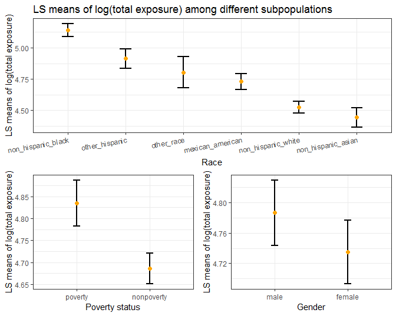

Report
================
JunLu
12/2/2018

Motivation
----------

肥胖pandemic, 全球健康危机，塑料污染 perevelance, WHO, US burden of disease, WHO, US

plasticizer pollution: start of concern, pediatrics society

related works
-------------

papaers: <http://ec.europa.eu/environment/aarhus/pdf/35/Annex_11_report_from_Lowell_Center.pdf>

websites: <https://www.plasticisers.org>

Initial Questions:
------------------

### : Initial questions:

\#\#: 谁暴露了？ 不同人群塑化剂分布 pls vs. race pls vs. income pls vs. obs \#\#： 危害程度（剂量（pls）/效应（obs） ）在不同人群一样么？多少大？

#### Data sources

All data was retrieved from the the [National Health and Nutrition Examination Survey](https://www.cdc.gov/nchs/nhanes/index.htm). The National Health and Nutrition Examination Survey (NHANES) is a program of studies designed to assess the health and nutritional status of adults and children in the United States.

We downloaded demographics data ([DEMO2011-2012](https://wwwn.cdc.gov/Nchs/Nhanes/2011-2012/DEMO_G.XPT), [DEMO2013-2014](https://wwwn.cdc.gov/Nchs/Nhanes/2013-2014/DEMO_H.XPT) and [DEMO2015-2016](https://wwwn.cdc.gov/Nchs/Nhanes/2015-2016/DEMO_I.XPT)), phthalates metabolites data ([PHTHTE2011-2012](https://wwwn.cdc.gov/Nchs/Nhanes/2011-2012/PHTHTE_G.XPT), [PHTHTE2013-2014](https://wwwn.cdc.gov/Nchs/Nhanes/2013-2014/PHTHTE_H.XPT) and [PHTHTE2015-2016](https://wwwn.cdc.gov/Nchs/Nhanes/2015-2016/PHTHTE_I.XPT)) and body measures data ([BMX2011-2012](https://wwwn.cdc.gov/Nchs/Nhanes/2011-2012/BMX_G.XPT), [BMX2013-2014](https://wwwn.cdc.gov/Nchs/Nhanes/2013-2014/BMX_H.XPT) and [BMX2015-2016](https://wwwn.cdc.gov/Nchs/Nhanes/2015-2016/BMX_I.XPT)) into three local files.

Variables used in demographics data:

-   `SEQN`: Respondent sequence number
-   `RIAGENDR`: Gender
-   `RIDAGEYR`: Age
-   `RIDRETH3`: Race and Hispanic origin information, with Non-Hispanic Asian Category
-   `INDFMPIR`: Ratio of family income to poverty

Variables used in phthalates metabolites data:

-   `SEQN`: Respondent sequence number
-   `URXMEP`: Mono-ethyl phthalate (ng/mL)
-   `URXMBP`: Mono-n-butyl phthalate (ng/mL)
-   `URXMIB`: Mono-isobutyl phthalate (ng/mL)
-   `URXMC1`: Mono-(3-carboxypropyl) phthalate (ng/mL)
-   `URXMZP`: Mono-benzyl phthalate (ng/mL)
-   `URXMHP`: Mono-(2-ethyl)-hexyl phthalate (ng/mL)
-   `URXMHH`: Mono-(2-ethyl-5-hydroxyhexyl) phthalate (ng/mL)
-   `URXMOH`: Mono-(2-ethyl-5-oxohexyl) phthalate (ng/mL)

Variables used in phthalates metabolites data

-   `SEQN`: Respondent sequence number
-   `BMXBMI`: Body Mass Index (kg/m\*\*2)
-   `BMDBMIC`: BMI Category - Children/Youth

Get the data
------------

``` r
download_nhanes = function(year, data_category){
  letter = c("2011-2012" = "G", "2013-2014" = "H", "2015-2016" = "I")
  url = str_c("https://wwwn.cdc.gov/Nchs/Nhanes/", year, "/", data_category, "_", letter[year], ".XPT")
  destfile_name = str_c("./data/", data_category, "/", data_category, year, ".XPT")
  download.file(url, destfile = destfile_name, method = "curl")
}


if (!file.exists("data")) {
  dir.create("./data")
  dir.create("./data/DEMO")
  dir.create("./data/PHTHTE")
  dir.create("./data/BMX")
  year = c("2011-2012", "2013-2014", "2015-2016")
  map(year, ~download_nhanes(.x, "DEMO"))
  map(year, ~download_nhanes(.x, "PHTHTE"))
  map(year, ~download_nhanes(.x, "BMX"))
}
```

We created a function (`download_nhanes`) to download data in NHANES according to the year and data category. Then we used this function and `map` to download demographics data, phthalates metabolites data and body measures data from 2011 to 2016 into three local files.

Read and clean the data
-----------------------

``` r
read_file_data = function(data_category){
  path = str_c("./data/", data_category, "/")
  file_name = tibble(file_name = list.files(path))
  file_name %>% 
    mutate(map(str_c(path, file_name), ~read.xport(.x))) %>% 
    unnest() 
}

phthte = read_file_data("PHTHTE")
demo = read_file_data("DEMO")
bmx = read_file_data("BMX")

phthte_demo = inner_join(demo, phthte, by = "SEQN") 
phthte_demo_bmx = inner_join(phthte_demo, bmx, by = "SEQN")

phthte_demo_bmx =
  phthte_demo_bmx %>% 
  select(id = SEQN, gender = RIAGENDR, age = RIDAGEYR, race = RIDRETH3, income = INDFMPIR, 
         bmi_cat = BMDBMIC, bmi = BMXBMI,MEP = URXMEP, MnBP = URXMBP, MiBP = URXMIB, 
         MCPP = URXMC1, MBzP = URXMZP, MEHP = URXMHP, MEHHP = URXMHH, MEOHP = URXMOH) %>%
  mutate(phthalate_all = MEP + MnBP + MiBP + MCPP + MBzP + MEHP + MEHHP + MEHHP,
         race = factor(race, levels = c(1, 2, 3, 4, 6, 7), 
                       labels = c("mexican_american", "other_hispanic", "non_hispanic_white",
                                  "non_hispanic_black", "non_hispanic_asian", "other_race")),
         gender = factor(gender, levels = c(1, 2), labels = c("male", "female")),
         bmi_cat = factor(bmi_cat, levels = c(1, 2, 3, 4), 
                          labels = c("underweight", "normal weight", "Overweight","obese")),
         age_cat = ifelse(age >= 2 & age <= 19, 1, 2),
         age_cat = factor(age_cat, levels = c(1, 2), 
                          labels = c("children", "adults")),
         poverty_status = ifelse(income >= 1, 2, 1), 
         poverty_status = factor(poverty_status, levels = c(1, 2), 
                                 labels = c("poverty", "nonpoverty"))) %>%
  gather(key = "phthalate", value = "concentrate", MEP:phthalate_all) %>% 
  mutate(log_value = log(concentrate)) %>% 
  filter(!is.na(concentrate))

str(phthte_demo_bmx)
```

    ## Classes 'tbl_df', 'tbl' and 'data.frame':    73341 obs. of  12 variables:
    ##  $ id            : int  62168 62169 62170 62171 62172 62174 62178 62184 62186 62189 ...
    ##  $ gender        : Factor w/ 2 levels "male","female": 1 1 1 1 2 1 1 1 2 2 ...
    ##  $ age           : int  6 21 15 14 43 80 80 26 17 30 ...
    ##  $ race          : Factor w/ 6 levels "mexican_american",..: 6 5 6 1 4 3 3 4 4 5 ...
    ##  $ income        : num  3.48 0.33 5 2.46 2.02 4.3 0.05 3.85 0.53 3.04 ...
    ##  $ bmi_cat       : Factor w/ 4 levels "underweight",..: 2 NA 2 2 NA NA NA NA 2 NA ...
    ##  $ bmi           : num  15.4 20.1 18.2 19.9 33.3 33.9 28.5 22.1 22.9 22.4 ...
    ##  $ age_cat       : Factor w/ 2 levels "children","adults": 1 2 1 1 2 2 2 2 1 2 ...
    ##  $ poverty_status: Factor w/ 2 levels "poverty","nonpoverty": 2 1 2 2 2 2 1 2 1 2 ...
    ##  $ phthalate     : chr  "MEP" "MEP" "MEP" "MEP" ...
    ##  $ concentrate   : num  10 7.4 4.3 25 115.8 ...
    ##  $ log_value     : num  2.3 2 1.46 3.22 4.75 ...

We created a function (`read_file_data`) to read and combine data with one document. And we applied this function to three files and got integrated demographics data, phthalates metabolites data and body measures data from 2011 to 2016 respectively. Then we used `inner_join` to integrate three datasets by `SEQN`.

We selected variables of interest and converted `gender`, `race`, `bmi_cat` and `poverty_status` into factors. For each individual, the total exposure (`phthte_all`) was calculated as the sum of exposure for each of the eight phthalates. Then we used `gather` to go from wide format to long format. As the concentrate value is extremely right skewed, we took log transformation of `concentrate` to create `log_value`.

The final dataset contains data for 8 urinary phthalate metabolites and related information from 8149 participants in the National Health and Nutrition Examination Survey (NHANES) 20011–2016. It contains 73341 observations and 12 variables.

-   `id`: Respondent sequence number
-   `gender`: Gender
-   `race`: Race and Hispanic origin information, with Non-Hispanic Asian Category
-   `poverty_status`: Poverty or nonpoverty
-   `bmi`: Body mass index (kg/m\*\*2)
-   `bmi_cat`: BMI Category (only for children/youth)
-   `age_cat`: Childer or adults

Exploratory analysis
--------------------

#### Categorical variables

``` r
phthte_demo_bmx %>% 
  filter(phthalate == "phthalate_all") %>% 
  CreateTableOne(data = ., 
                 vars = c("gender", "race", "age_cat", "poverty_status")) %>% 
  print(printToggle = FALSE, noSpaces = TRUE, showAllLevels = TRUE) %>% 
  knitr::kable()
```

|                     | level                | Overall     |
|---------------------|:---------------------|:------------|
| n                   |                      | 8149        |
| gender (%)          | male                 | 4018 (49.3) |
|                     | female               | 4131 (50.7) |
| race (%)            | mexican\_american    | 1349 (16.6) |
|                     | other\_hispanic      | 883 (10.8)  |
|                     | non\_hispanic\_white | 2662 (32.7) |
|                     | non\_hispanic\_black | 1972 (24.2) |
|                     | non\_hispanic\_asian | 942 (11.6)  |
|                     | other\_race          | 341 (4.2)   |
| age\_cat (%)        | children             | 2940 (36.1) |
|                     | adults               | 5209 (63.9) |
| poverty\_status (%) | poverty              | 2030 (27.4) |
|                     | nonpoverty           | 5385 (72.6) |

#### Continuous variable

``` r
phthte_demo_bmx %>% 
  CreateTableOne(data = ., 
                 vars = c("age", "bmi", "log_value")) %>% 
  print(printToggle = FALSE, noSpaces = TRUE, smd = TRUE) %>% 
  knitr::kable()
```

|                        | Overall       |
|------------------------|:--------------|
| n                      | 73341         |
| age (mean (sd))        | 35.17 (23.30) |
| bmi (mean (sd))        | 26.16 (7.74)  |
| log\_value (mean (sd)) | 2.12 (1.77)   |

We computed a few summary statistics and checked whether there are enough samples to do analyses in each subpopulation(race, gender, age and poverty status).

### Percent contribution of individual phthalates to the sum-total exposure

``` r
library(scales)
bar_1 = 
  phthte_demo_bmx %>% 
  filter(phthalate != "phthalate_all") %>% 
  group_by(race, phthalate) %>% 
  summarize(mean = mean(log_value)) %>% 
  ggplot(aes(x = race, y = mean, fill = phthalate)) + 
  geom_bar(position = "fill",stat = "identity", width = 0.4) +
  scale_y_continuous(labels = percent_format()) +
  theme(axis.text.x = element_text(angle = 10, hjust = 1)) +
  scale_fill_brewer(palette = "Pastel2") +
  labs(
    title = "Percent contribution of individual phthalates to the sum-total exposure",
    x = "Race",
    y = "Percent contribution"
  )

bar_2 = 
  phthte_demo_bmx %>% 
  filter(phthalate != "phthalate_all") %>% 
  filter(!is.na(poverty_status)) %>% 
  group_by(poverty_status, phthalate) %>% 
  summarize(mean = mean(log_value)) %>% 
  ggplot(aes(x = poverty_status, y = mean, fill = phthalate)) + 
  geom_bar(position = "fill",stat = "identity", width = 0.4) +
  scale_y_continuous(labels = percent_format()) +
  scale_fill_brewer(palette = "Pastel2") +
  labs(
    x = "Poverty_status",
    y = "Percent contribution"
  ) +
    guides(fill = FALSE)

bar_3 =
  phthte_demo_bmx %>% 
  filter(phthalate != "phthalate_all") %>% 
  group_by(age_cat, phthalate) %>% 
  summarize(mean = mean(log_value)) %>% 
  ggplot(aes(x = age_cat, y = mean, fill = phthalate)) + 
  geom_bar(position = "fill",stat = "identity", width = 0.4) +
  scale_y_continuous(labels = percent_format()) +
  scale_fill_brewer(palette = "Pastel2") +
  labs(
    x = "Child or adult",
    y = "Percent contribution"
  ) +
    guides(fill = FALSE)

bar_4 = 
  phthte_demo_bmx %>% 
  filter(phthalate != "phthalate_all") %>% 
  group_by(gender, phthalate) %>% 
  summarize(mean = mean(log_value)) %>% 
  ggplot(aes(x = gender, y = mean, fill = phthalate)) + 
  geom_bar(position = "fill",stat = "identity", width = 0.4) +
  scale_y_continuous(labels = percent_format()) +
  scale_fill_brewer(palette = "Pastel2") +
  labs(
    x = "Gender",
    y = "Percent contribution"
  ) +
  guides(fill = FALSE)

bar_1 + (bar_2 + bar_3 + bar_4) + plot_layout(ncol = 1)
```


### Distribution plots

``` r
race_dist =
  phthte_demo_bmx %>% 
  filter(phthalate == "phthalate_all") %>% 
  mutate(race = forcats::fct_reorder(race, log_value, .desc = T)) %>% 
  ggplot(aes(x = race, y = log_value, fill = race)) +
  geom_violin() +
  stat_summary(fun.y = median, geom = "point", size = 1) +
  labs(
    x = "Race",
    y = "Log value of phthalates concentrate ",
    title = "Distribution of log(total exporsure) in different races"
    ) +
  theme(axis.text.x = element_text(angle = 10, hjust = 1)) +
  scale_fill_brewer(palette = "Pastel2")

age_dist =
  phthte_demo_bmx %>% 
  filter(phthalate == "phthalate_all") %>% 
  mutate(age_cat = forcats::fct_reorder(age_cat, log_value, .desc = T)) %>% 
  ggplot(aes(x = age_cat, y = log_value, fill = age_cat)) +
  geom_violin() +
  stat_summary(fun.y = median, geom = "point", size = 1) +
  labs(
    x = "Children or adults",
    y = "Log value of phthalates concentrate "
    ) +
  scale_fill_brewer(palette = "Pastel2")

poverty_status_dist =
  phthte_demo_bmx %>% 
  filter(phthalate == "phthalate_all") %>% 
  filter(!is.na(poverty_status)) %>% 
  mutate(poverty_status = forcats::fct_reorder(poverty_status, log_value, .desc = T)) %>% 
  ggplot(aes(x = poverty_status, y = log_value, fill = poverty_status)) +
  geom_violin() +
  stat_summary(fun.y = median, geom = "point", size = 1) +
  labs(
    x = "Poverty_statuse",
    y = "Log value of phthalates concentrate ",
    title = "Distribution of log(total exporsure) in different subpopulations"
    ) +
  scale_fill_brewer(palette = "Pastel2")

gender_dist =
  phthte_demo_bmx %>% 
  filter(phthalate == "phthalate_all") %>% 
  mutate(gender = forcats::fct_reorder(gender, log_value, .desc = T)) %>% 
  ggplot(aes(x = gender, y = log_value, fill = gender)) +
  geom_violin() +
  stat_summary(fun.y = median, geom = "point", size = 1) +
  labs(
    x = "Gender",
    y = "Log value of phthalates concentrate "
    ) +
  scale_fill_brewer(palette = "Pastel2")

poverty_status_dist + gender_dist + age_dist + plot_layout(nrow = 1)
```


``` r
race_dist
```


We stratfied the study population on the basis of gender, poverty status, race and age, and we made violin plots for each subpopulation. From violin plots, we can see that there were between-group differences in log(phthalates concentrate) on the basis of race and poverty status. However, differences are not very obvious in violin plots.

LS means analysis
-----------------

In order to compare phthalates concentrate in different subpopulations, we fitted a multilinear model and calculated the least square means.

### Fit a multilinear model

``` r
multi_fit = 
  phthte_demo_bmx %>% 
  filter(phthalate == "phthalate_all") %>%
  lm(log_value ~ age + gender + race + poverty_status + bmi , data = .)

summary(multi_fit)
```

    ## 
    ## Call:
    ## lm(formula = log_value ~ age + gender + race + poverty_status + 
    ##     bmi, data = .)
    ## 
    ## Residuals:
    ##     Min      1Q  Median      3Q     Max 
    ## -3.9159 -0.7135 -0.0245  0.6573  5.6830 
    ## 
    ## Coefficients:
    ##                            Estimate Std. Error t value Pr(>|t|)    
    ## (Intercept)               4.4695742  0.0572272  78.102  < 2e-16 ***
    ## age                       0.0005124  0.0006365   0.805 0.420861    
    ## genderfemale             -0.0514466  0.0257705  -1.996 0.045935 *  
    ## raceother_hispanic        0.1821850  0.0511153   3.564 0.000367 ***
    ## racenon_hispanic_white   -0.2048329  0.0398433  -5.141 2.80e-07 ***
    ## racenon_hispanic_black    0.4091363  0.0414398   9.873  < 2e-16 ***
    ## racenon_hispanic_asian   -0.2885560  0.0510459  -5.653 1.64e-08 ***
    ## raceother_race            0.0722174  0.0700663   1.031 0.302714    
    ## poverty_statusnonpoverty -0.1481390  0.0296778  -4.992 6.13e-07 ***
    ## bmi                       0.0131835  0.0018784   7.019 2.44e-12 ***
    ## ---
    ## Signif. codes:  0 '***' 0.001 '**' 0.01 '*' 0.05 '.' 0.1 ' ' 1
    ## 
    ## Residual standard error: 1.102 on 7344 degrees of freedom
    ##   (795 observations deleted due to missingness)
    ## Multiple R-squared:  0.07085,    Adjusted R-squared:  0.06971 
    ## F-statistic: 62.22 on 9 and 7344 DF,  p-value: < 2.2e-16

We fitted a multilinear model (log\_value ~ age + gender + race + poverty\_status + bmi) and found that gender, race, poverty\_status and bmi are significant predictors in this model.

### Compare least square means

``` r
race_ls = lsmeans(multi_fit, pairwise ~ race, adjust = "tukey")

p1_race =
  race_ls$lsmeans %>%
  broom::tidy() %>% 
  mutate(race = forcats::fct_reorder(race, estimate, .desc = T)) %>% 
  ggplot(aes(x = race, y = estimate)) + 
  geom_errorbar(aes(x = race, ymin = conf.low, ymax = conf.high), size = 1, width = 0.2) +
  geom_point(color = "orange", size = 2) +
  labs(
    title = "LS means of log(total exposure) among different subpopulations",
    x = "Race",
    y = "LS means of log(total exposure)"
  ) +
  theme(axis.text.x = element_text(angle = 10, hjust = 1))

poverty_ls = lsmeans(multi_fit, pairwise ~ poverty_status, adjust = "tukey")
p2_poverty =
  poverty_ls$lsmeans %>%
  broom::tidy() %>% 
  mutate(poverty_status = forcats::fct_reorder(poverty_status, estimate, .desc = T)) %>% 
  ggplot(aes(x = poverty_status, y = estimate)) + 
  geom_errorbar(aes(x = poverty_status, ymin = conf.low, ymax = conf.high), size = 1, width = 0.1) +
  geom_point(color = "orange", size = 2) +
  labs(
    x = "Poverty status",
    y = "LS means of log(total exposure)"
  ) 

gender_ls = lsmeans(multi_fit, pairwise ~ gender, adjust = "tukey")
p3_gender =
  gender_ls$lsmeans %>%
  broom::tidy() %>% 
  mutate(gender = forcats::fct_reorder(gender, estimate, .desc = T)) %>% 
  ggplot(aes(x = gender, y = estimate)) + 
  geom_errorbar(aes(x = gender, ymin = conf.low, ymax = conf.high), size = 1, width = 0.1) +
  geom_point(color = "orange", size = 2) +
  labs(
    x = "Gender",
    y = "LS means of log(total exposure)"
  ) 


p1_race + (p2_poverty + p3_gender) + plot_layout(ncol = 1)
```



Plots shows least square mean value and 95% confidence intervals of log(total exposure) by race, poverty status and gender. (Least square means are means for groups that are adjusted for other terms in the model.)

-   Levels of the total phthalates were significantly higher in non\_hispanic\_black.
-   Levels of the total phthalates were significantly higher in poverty.
-   Levels of the total phthalates were higher in male.

Obesity analysis
----------------

``` r
phthte_children = phthte_demo_bmx %>% filter(age_cat == "children")

phthte_adult = phthte_demo_bmx %>% 
  filter(age_cat == "adults") %>%
  mutate(overweight_status = ifelse(bmi >= 25, 1, 2),
         overweight_status = factor(overweight_status, levels = c(1, 2), labels = c("overweight", "normal")))
```
